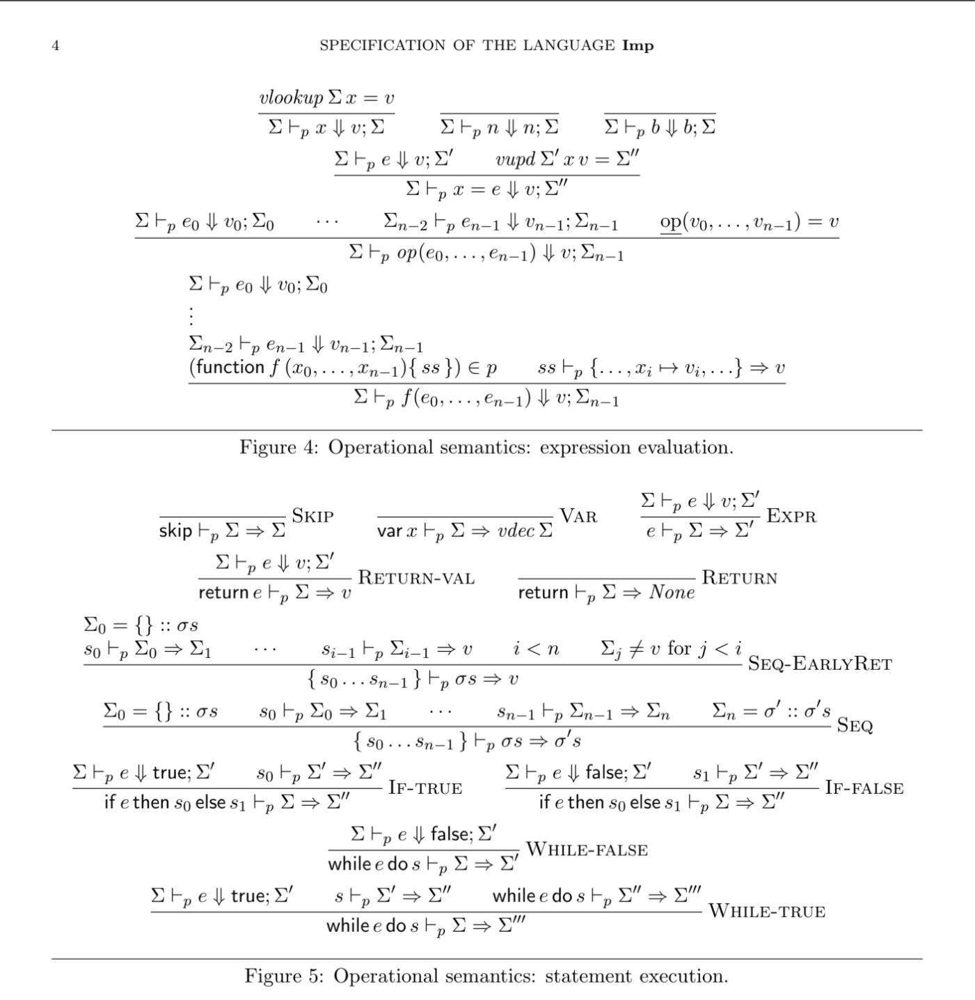

# Project #1: Imp - Static Program Analysis

Welcome to Project 1 of COMP360H: Static Program Analysis at Wesleyan University. This repository contains the implementation of an interpreter for **Imp**, our own small imperative programming language. The project is maintained by:

- Nishant Aggarwal ([@n-aggarwal](https://github.com/n-aggarwal))
- Cristi Gonzalez ([@cgonzalezt](https://github.com/cgonzalezt))
- Christian Diaz Herrera ([@cdiazherrera](https://github.com/cdiazherrera))

## About Imp

Imp is an imperative programming language featuring many modern language constructs including if statements, while statements, functions, block scoping, and expression evaluation. Currently, the language supports only integer (`Int`) and boolean (`Bool`) values.

### Language Semantics

Below is a detailed account of the language semantics:

## Implementation Details

The interpreter for Imp is written in OCaml, leveraging its functional programming capabilities.

## Getting Started

To run and test the interpreter, follow these steps:

1. Clone this repository to your local machine.
2. Ensure you have OCaml installed.
3. Navigate to the project directory.
4. Build the Program using Dune.
5. Execute the interpreter with an Imp program file as input.

## Contributing

We welcome contributions to enhance the Imp interpreter. If you find any bugs or have ideas for improvements, feel free to submit issues or pull requests.

## License

This project is licensed under the [MIT License](LICENSE), allowing for both personal and commercial use with proper attribution.

---

We hope you find the Imp interpreter insightful and helpful. If you have any questions or feedback, don't hesitate to reach out to us!
